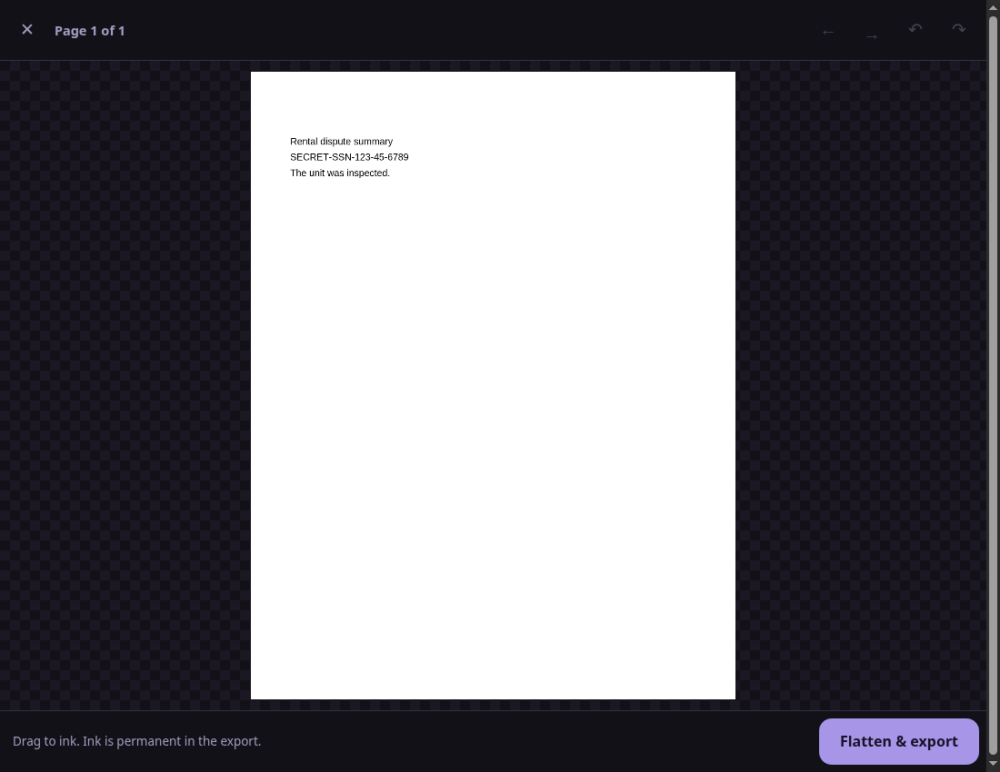
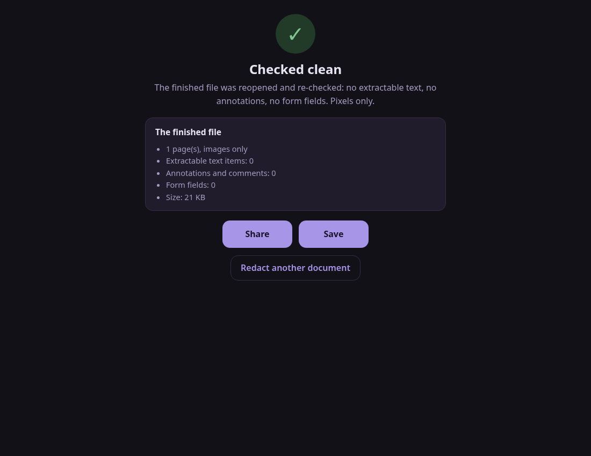

# Blot

  

Redaction that destroys what it covers.

The redaction failures that make the news share one anatomy: a black
rectangle drawn over text that was still in the file. Copy, paste, and
the "redacted" names are on the clipboard. Courts have done it, law firms
have done it, government agencies keep doing it, because most PDF tools
treat redaction as decoration.

Blot treats it as demolition. Your document's pages are rendered to plain
pixels, your ink is painted into those pixels, and a brand new PDF is
built containing only the pictures. There is no text layer in the output
because there is no text in it at all, no annotations, no form data, no
attachments, no metadata, no earlier versions. The finished file is then
reopened and re-checked in front of you: zero extractable text items,
zero annotations, zero form fields, or you see exactly what survived.

Documents Blot cannot flatten honestly get refused with an explanation,
not half-handled: password-protected files, filled forms, XFA, and
digitally signed documents each get told why and what to do instead. The
trade is stated plainly too: the output is a picture of a document. It
prints and reads fine; it is not editable and not searchable. That is
the cost of certain.

  
  

## Get it

**Android:** install [blot.apk](https://github.com/munzzyy/blot/releases/latest/download/blot.apk)
on Android 10 or newer. It's not in the Play Store, so Android will warn
you that it's blocking an install from outside the store; that warning
exists for apps that misuse permissions, and Blot asks for none. Settings
offers a one-time "install anyway," which is the only extra step. The
same release link always points at the current version, so an updater
like Obtainium can track it for you.

**iPhone:** there is no hosted copy of the web app to install yet and
Blot is not on the App Store. Build the `ios/` wrapper yourself with
Xcode ([docs/IOS.md](docs/IOS.md)) or run `node test/serve_local.mjs` on
a computer and open it in Safari on the same network.

**Anywhere else:** `app/` is the whole web app, a static page with no
build step and no server side; serve it from anything that can serve
files.

## Check the claims

`npm test` validates the PDF writer against poppler, a completely
independent implementation: image-only output must yield zero text to
pdftotext. `npm run e2e` goes end to end: a real PDF with a planted
secret goes in, ink goes over it, and the output is checked outside the
app three ways: pdftotext extracts nothing, the secret string exists
nowhere in the raw output bytes, and the re-rendered page is probed to
confirm the ink is really there. The APK requests no Android permissions,
not even INTERNET; its one manifest entry is androidx's self-scoped
not-exported marker, which grants nothing.

The web app has one dependency, on purpose: Mozilla's PDF.js reads the
input, vendored at a pinned version whose checksum is verified against
the npm registry. CI re-checks every vendored file's checksum on every
push; provenance and manual re-verification steps:
`app/vendor/pdfjs/PROVENANCE.md`. Everything else in the web app,
including the PDF writer, is dependency-free (the Android wrapper carries
the standard androidx runtime, like any modern app).

## Run it

For development: `node test/serve_local.mjs` serves the web app, and
`cd android && ./gradlew assembleDebug` builds an installable debug APK
(release signing goes through `tools/release-android.sh`).

There is also a native iOS wrapper around the same `app/`, built with
Xcode from a generated project rather than a checked-in one. It has no
prebuilt release yet, and there is no hosted copy of the web app to
install from Safari either; both are build-it-yourself for now. Details,
and exactly how the wrapper differs from the Android app:
[docs/IOS.md](docs/IOS.md).

## Bugs, holes, contributions

Getting text, form data, or metadata out of a Blot output is the bug
that matters; [SECURITY.md](SECURITY.md) has the private route for that.
Everything else: issues and pull requests are open and welcome. Releases
list the APK's sha256 and signing certificate digest.

## License

MIT. The vendored PDF.js is Apache-2.0.
